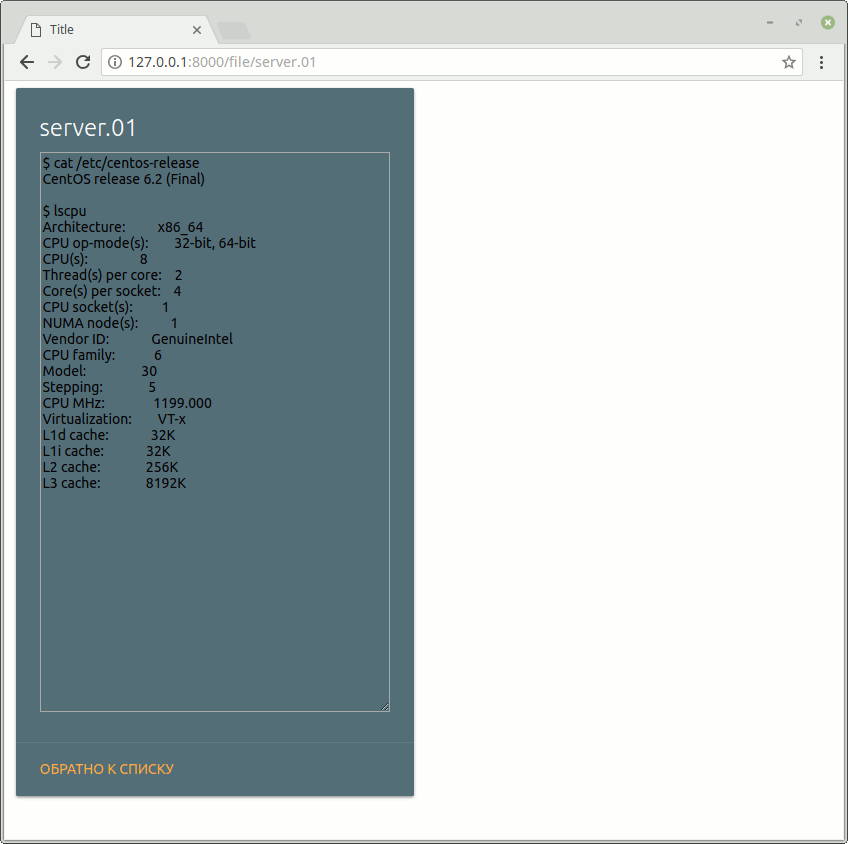

# Работа с менеджером урлов

## Задание

Необходимо в менеджере урлов `app/urls.py`
реализовать схему отображения для трех ситуаций:

* отображение списка файлов
* отображение списка файлов с фильтрацией по дате `/2018-01-01/`
* отображение отдельных файлов `/file_name.txt`

Для первых двух ситуаций использовать один класс для отображения: `app.views.FileList`
Для второй ситуации реализовать конвертер для преобразования даты
`datetime.date` в указанный в задании вид и наоборот.
Для третьей ситуации использовать функцию для отображения: `app.views.file_content`

В классе `app.views.FileList` и функции `app.views.file_content`
реализовать логику для формирования контекста.
Директорую, файлы которой нужно отобржать берите из настроек `settings.FILES_PATH`



## Вспомогательная информация

Используйте:

* [os.listdir](https://docs.python.org/3/library/os.html#os.listdir) для получения списка файлов
* [os.stat](https://docs.python.org/3/library/os.html#os.stat) для получения данных по файлам

## Документация по проекту

Для запуска проекта необходимо:

Установить зависимости:

```bash
pip install -r requirements.txt
```

Создать файл с локальными настройками `app/settings_local.py`
и задать туда обязательные параметры:

* SECRET_KEY - секретная строка
* FILES_PATH - путь до директории с файлами

Например:

```python
import os

SECRET_KEY = 'd+mw&mscg5i&tx+#@bf+6m%e+d5z!u#!n%z-^o9u7y1felv2o&'

BASE_DIR = os.path.dirname(os.path.dirname(os.path.abspath(__file__)))
```

Выполнить команду:

```bash
python manage.py runserver
```